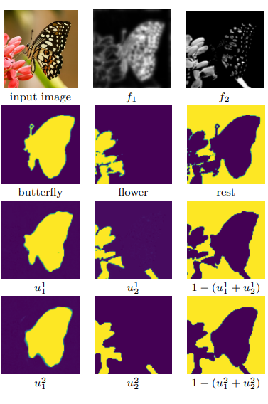
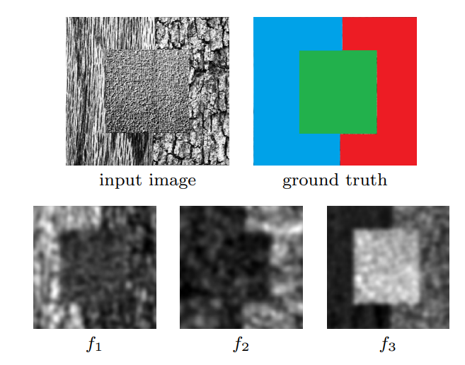

# Lifting-based-variational-multiclass-segmentation

This repository contains the source code of the paper "Lifting-based variational multiclass segmentation: design, analysis and implementation". 

## Highlights
The main components of the proposed pipeline are as follows:

1. Lifting: Choose $K$ feature enhancing transforms $\Phi_1,\dots,\Phi_K$ in a way thath the intensity values of the $k$-th feature map $\phi_K\coloneqq\Phi_k(f)$ allow to well separate $\Sigma_k$ rom the remaining part $\Omega\setminus\Sigma_k$.

2. Minimization: For given parameter $\lambda>0$, compute a minimizer of the proposed energy functional (see p.2 Problem 1.1 in the paper)
3. Assignment: For each $k\in\{0,\dots,K\}$ define the region $\Sigma_k$ as the set of all $x\in\Omega$ such that $u_k^{\lambda}(x)$ is maximal along the values $u_0^{\lambda}(x),\dots,u_K^{\lambda}(x)$.

## Requirements
To install the requirements needed to run the code via anaconda execute:

* conda create --name <env> --file requirements.txt

The required packages are:

 1. scipy=1.7.3
 2. scikit-image=0.19.2
 3. scikit-learn=1.0.2
 4. matplotlib=3.5.1

 
Note: Other versions of these packages might work too, these are just those we used. The complete list of packages and corresponding versions is provided in requirements.txt.
## Code
The code consists of the following parts:
1. Functions.py: This script contains all of the functions needed (for a detailed description of these functiosn we refer to Section 3 of the manuscript)
2. Code.py: In this script, the segmentation process is executed. The list f represents the multichannel inputs which result from prefiltering. The images should be noramlized to have values in [0,1].
3. gabor.py: This script is used for creating a filterbank for the texture based pre-filtering which was applied. This code runs for the Brodatz3- example from the paper and can be adapted in an analogous manner for the other examples as well. To run this code you will need the image textur_3channel.png which can be found in the folder Brodatz.

In the subfolders ``Butterfly``,``Brodatz`` and ``Brats`` the codes and required images corresponding to these three examples are provided. 

 
 ## Example
 The feature maps are extracted either by the application of Gabor filters of a suitable RGB filtering. The provided code examples were used to create the following figures visualized in the paper.
 

 
